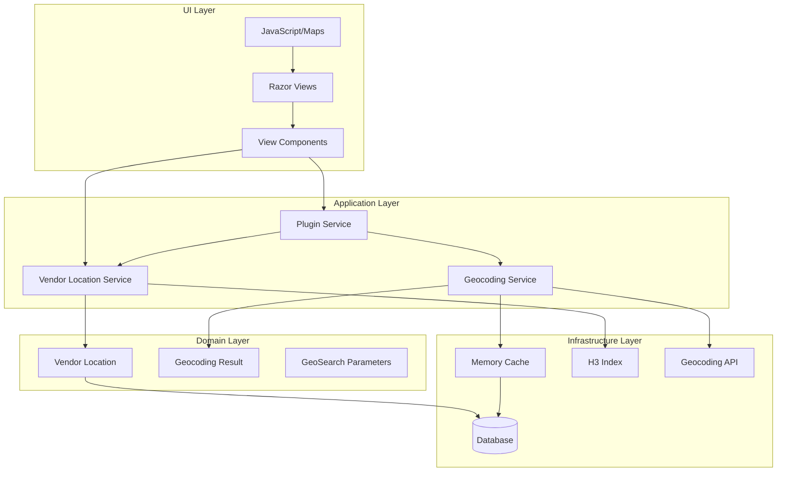
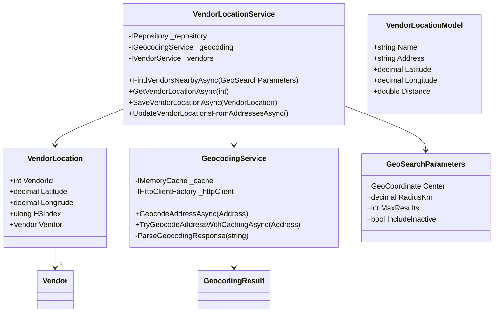
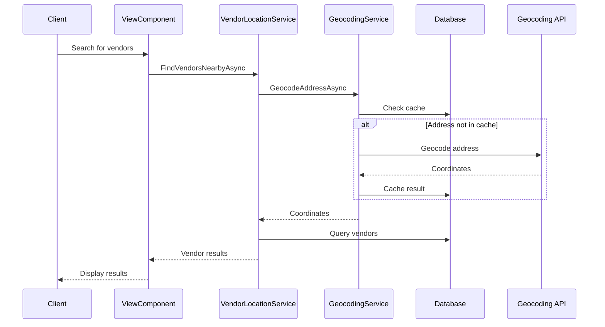

# nopCommerce Demo Basic Plugin

A geolocation-based vendor discovery solution for nopCommerce that enhances the marketplace experience by connecting customers with nearby vendors.

## Core Features

### Vendor Location Management
- Automatically geocodes vendor addresses into precise coordinates (latitude/longitude)
- Stores vendor locations using H3 spatial indexing for efficient geographic queries
- Maintains location data freshness through automatic updates when vendor addresses change
- Interactive map display for vendor locations

### Proximity-Based Vendor Search
- Allows customers to find vendors within a specified radius
- Supports configurable search radius (default and maximum)
- Returns vendors sorted by distance from a given location
- Optimizes search performance using H3 spatial indexing
- Visual map representation of search results

### Multi-Store Support
- Configurable per store in multi-store setups
- Store-specific settings for:
  - Default search radius
  - Geocoding API key
  - Google Maps API key
  - Cache duration for geocoded addresses

## Business Benefits

### For Customers
- Find local vendors quickly
- See vendor distances on product pages
- Interactive maps showing vendor locations
- Make informed purchasing decisions based on vendor proximity
- Reduce shipping costs by choosing nearby vendors

### For Vendors
- Increased visibility to local customers
- Automatic location management (no manual coordinate entry needed)
- Visual representation of store location on maps
- Competitive advantage in local markets
- Potential for reduced shipping costs

### For Store Owners
- Enhanced marketplace functionality
- Improved customer experience with visual map integration
- Efficient vendor discovery
- Reduced support overhead through automated location management
- Cache optimization for better performance

## Technical Features

### Geocoding Service
- Converts physical addresses to coordinates
- Caches results to reduce API calls
- Configurable cache duration
- API key management for geocoding services

### Location Services
- High-performance spatial queries using H3 indexing
- Accurate distance calculations
- Support for large vendor databases
- Efficient nearby vendor discovery

### Map Integration
- Interactive Google Maps integration
- Custom map styling and controls
- Responsive map containers
- Marker clustering for multiple vendors
- Info windows with vendor details
- Dynamic marker highlighting on list hover

### UI Components
- Vendor location widget with map
- Vendor search interface with list and map view
- Distance display in search results
- Mobile-friendly responsive design
- Modern styling with hover effects

## Architecture

### Overview

The plugin follows a clean architecture pattern with clear separation of concerns and dependency inversion. It integrates with nopCommerce's plugin infrastructure while maintaining loose coupling.

### Component Diagram



### Class Diagram



### Sequence Diagram: Vendor Search Flow



### Architecture Patterns

#### Domain-Driven Design
- Clear domain models (`VendorLocation`, `GeoSearchParameters`)
- Rich domain services with business logic
- Value objects for immutable concepts
- Repository pattern for data access

#### SOLID Principles
1. **Single Responsibility**
   - Each service has a focused purpose
   - Clear separation between geocoding and vendor location logic

2. **Open/Closed**
   - Plugin architecture allows extension
   - Interface-based design for services

3. **Liskov Substitution**
   - Services implement clear interfaces
   - Mockable components for testing

4. **Interface Segregation**
   - Focused interfaces for services
   - Separate models for different layers

5. **Dependency Inversion**
   - Services depend on abstractions
   - Infrastructure concerns isolated

#### Caching Strategy
- Two-level caching approach:
  1. Memory cache for geocoding results
  2. H3 index for spatial queries
- Configurable cache duration
- Thread-safe implementation

#### Error Handling
- Graceful degradation
- Comprehensive logging
- User-friendly error messages
- Retry mechanisms for external services

### Data Flow

1. **User Request Flow**
```
User Request → Controller/ViewComponent → Service Layer → Domain Layer → Infrastructure → External Services
```

2. **Data Access Flow**
```
Repository → Entity Framework Core → SQL Server → Cached Results
```

3. **Caching Flow**
```
Request → Memory Cache → Geocoding API → Update Cache → Return Result
```

### Security Considerations

1. **API Key Management**
   - Secure storage in nopCommerce settings
   - Per-store configuration
   - Key rotation support

2. **Data Protection**
   - Vendor location data encryption
   - Address information protection
   - Cache security

3. **Request Validation**
   - Input sanitization
   - Rate limiting
   - Access control

### Testing Strategy

1. **Unit Tests**
   - Service layer testing
   - Domain logic validation
   - Mocked dependencies

2. **Integration Tests**
   - Database operations
   - Cache interactions
   - API communication

3. **UI Tests**
   - ViewComponent rendering
   - JavaScript functionality
   - Map integration

### Deployment Considerations

1. **Dependencies**
   - .NET 9.0 runtime
   - SQL Server
   - Memory requirements
   - API access

2. **Configuration**
   - Environment-specific settings
   - API keys management
   - Cache settings

3. **Monitoring**
   - Performance metrics
   - Error tracking
   - Usage statistics

## Configuration

### Search Settings
- Default search radius
- Maximum search radius
- Results limit

### API Settings
- Geocoding API key configuration
- Google Maps API key
- Cache duration
- Address validation options

### Display Settings
- Distance unit preference (km/miles)
- Location display format
- Widget placement options
- Map display options

## Installation

1. Download the plugin from the nopCommerce marketplace
2. Upload and install the plugin through your nopCommerce admin panel
3. Configure the plugin settings:
   - Enter your geocoding API key
   - Enter your Google Maps API key
   - Set default search radius
   - Configure cache duration
4. The plugin will automatically start geocoding vendor addresses

## Usage

### For Store Owners
1. Go to Configuration → Local Plugins
2. Find "Demo Basic Plugin" and click Configure
3. Set up your preferred configuration options
4. The plugin will automatically process vendor addresses

### For Customers
1. Browse products as usual
2. View vendor locations and distances on product pages
3. Use the vendor search to find nearby vendors
4. Interact with the map to explore vendor locations
5. Filter search results by distance

## Technical Requirements

- nopCommerce 4.60 or later
- .NET 9.0
- Access to a geocoding service (API key required)
- Google Maps JavaScript API key
- Sufficient storage for location caching

## Integration Points

### nopCommerce Core
- Vendor management system
- Product catalog
- Multi-store functionality
- Address management

### External Services
- Geocoding APIs
- Google Maps JavaScript API
- Location validation services

### User Interface
- Product pages
- Vendor listings with maps
- Search results with map integration
- Admin configuration panels

## Performance Considerations

- Uses H3 spatial indexing for efficient location queries
- Implements smart caching to reduce API calls
- Optimizes database queries for large vendor sets
- Supports high-traffic marketplace scenarios
- Lazy loading of map resources
- Efficient marker management for large datasets

## Support

For support, please:
1. Check the [documentation](https://docs.nopcommerce.com/en/plugins/demo-basic-plugin.html)
2. Visit our [community forums](https://www.nopcommerce.com/boards/)
3. Contact our [support team](https://www.nopcommerce.com/contact-us)

## Contributing

We welcome contributions! Please:
1. Fork the repository
2. Create a feature branch
3. Submit a pull request

## License

This plugin is released under the nopCommerce license. See the LICENSE file for details.
